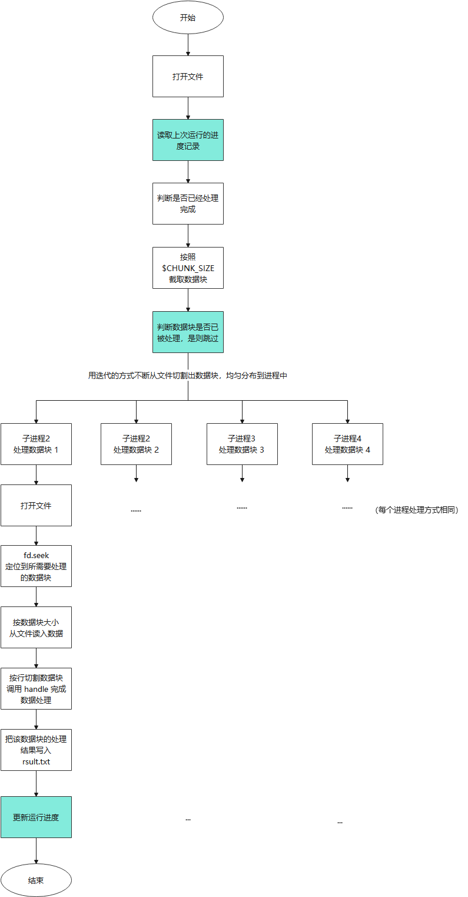
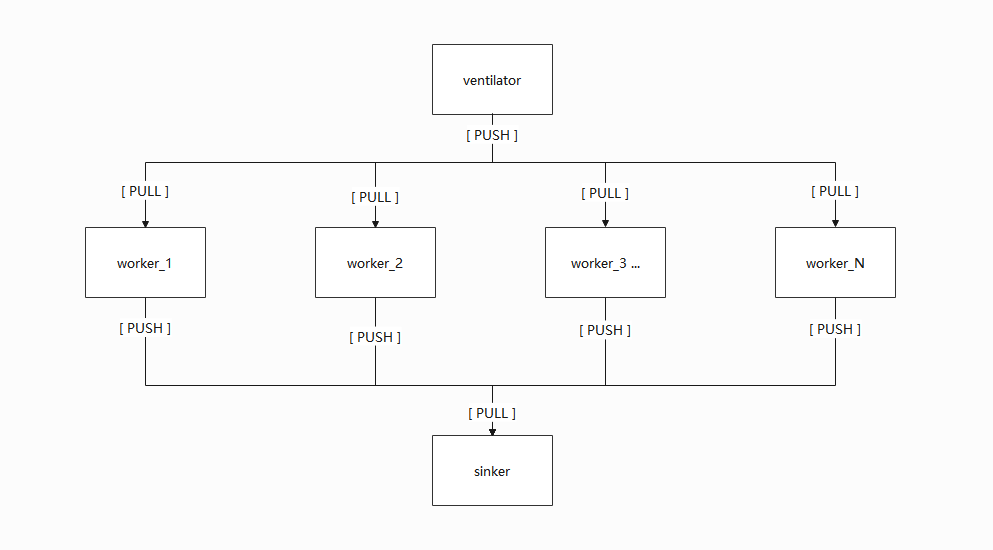

- [LargeFileHandler](#largefilehandler)
  - [题目](#题目)
  - [要求](#要求)
  - [注意](#注意)
- [需求分析](#需求分析)
- [解决方案](#解决方案)
  - [假数据构造](#假数据构造)
  - [正确性判断](#正确性判断)
  - [数据量分析](#数据量分析)
  - [单机处理](#单机处理)
    - [处理流程](#处理流程)
    - [执行方法](#执行方法)
    - [准确性](#准确性)
  - [支持中断继续](#支持中断继续)
    - [正常运行时](#正常运行时)
    - [进度记录文件丢失时](#进度记录文件丢失时)
    - [程序异常中断时](#程序异常中断时)
    - [测试数据](#测试数据)
  - [分布式处理](#分布式处理)
    - [处理流程](#处理流程-1)
    - [执行方法](#执行方法-1)
    - [任务分发 Server](#任务分发-server)
    - [结果汇总处理 Sinker](#结果汇总处理-sinker)
    - [客户端 Client](#客户端-client)

# LargeFileHandler

## 题目

有一个很大的文本文件，它的大小可能有 **`几TB`**，其中存储的任何行的架构文本文件如下：

```json
{
    "id": string,         // uuid, it is unique in this file
    "symbol": string,     // symbol
    "price": double,      // the price of the symbol
    "quantity": double,   // the quantity of the symbol
    "type": string,       // the type, the optional value may be stock, future, option, fund.
    "datetime": string,   // the datetime of the current line
}
```

有一个函数可以处理一行，签名如下：

```py
def handle(id:str, symbol:str, price: Decimal, quantity:Decimal, type: str, dt: datetime) -> str:
    # Hide detail code
    pass

```

您需要将句柄函数的结果写入另一个名为 `result.txt` 的文本文件，并且随意将结果写入 `result.txt`，你可以乱写，如果逐行处理这个文件将很容易完成任务。

## 要求

- 你能写出最简单的程序来逐行处理文件吗？

- 你能设计一个高效的程序来同时处理这个文件吗？请注意以下任何一项：

  - 并行处理的程度。

  - 程序中断后，在下次启动时继续处理。

  - 您要处理的其他异常。

- 请告诉我们您的设计理念，自由写设计文档，比如只写字，绘制设计图（UML 或流程图），编写伪代码等。

如果您完成了代码，您将非常出色。

## 注意

- handle 函数处理时，一整行在被处理时不依赖文件中的其他行。

- 我们进一步测试发现 handle 函数的消耗时间是随机的，这不是一个错误，因为耗时取决于数据计算的复杂性。

- 假设有`多台`电脑，其中任何一台都是 `64核、128GB内存，500GB 硬盘`，有一个数据存储服务器，配置是 `64核、128GB内存、1PB 硬盘`。

- 注意记录任何对我们后期调试有用的方法的调试消息，如果出现任何异常。

- 如果需要，请随意使用第三方库，例如 Message Queue 和 Log。

- 如果您有任何问题，请尽快告诉我们。

# 需求分析


# 解决方案

## 假数据构造

[tools/fake.sh](./tools/fake.sh)

```sh
# 文件已有行数 n
# 一下命令生成 n * 2^30 行数据

# generate test file input.txt


content='{"id": "c9b72270-b548-47f5-af9d-6372846bd758", "symbol": "166842.XSHE", "price": 66.51, "quantity": 295, "type": "feature", "datetime": "2011-07-16 00:42:32481"}' > input.txt
echo $content > input.txt

# it will generate 1 * 2^30 lines

# _1GB = 1073741824 bytes
# lines = _1GB / sizeof($content) # 6669203.875776397 lines
# 2^22 = 4194304  lines -----> 644 MB
# 2^23 = 8388608  lines -----> 1.2578125 GB
# 2^24 = -----> 2.515625 GB
# 2^25 = -----> 5.03125 GB
# 2^26 = -----> 10.0625 GB
# 2^27 = -----> 20.125 GB
# 2^28 = -----> 40.25 GB
# 2^29 = -----> 80.5 GB
# 2^30 = -----> 161.0 GB

for i in {1..22}; do cat input.txt input.txt > input2.txt && mv input2.txt input.txt; done

wc input.txt
```

## 正确性判断

生成 `input.txt` 输入文件时，所有行的内容全部设置一样，最终判断一下 `input.txt` 和 `result.txt` 的 `md5` 是否一样即可

## 数据量分析

如下格式的一条数据，存储占用 161 字节，1TB 大小的文件

```json
{
    "id": "c9b72270-b548-47f5-af9d-6372846bd758",
    "symbol": "166842.XSHE",
    "price": 66.51,
    "quantity": 295,
    "type": "feature",
    "datetime": "2011-07-16 00:42:32481"
}
```

```py
_1KB = 1024 # byte
_1MB = 1024 * 1024
_1GB = 1024 * 1024 * 1024
#    = 1073741824 byte
#    ==> 1073741824 / 161 = 6669203.875776397 ≈ 667 0000 （667 万）行

_1TB = 1024 * 1024 * 1024 * 1024
#    = 1099511627776 byte
#    = 1099511627776 / 161 = 6829264768.795031 约等于 68 2926 4768 （68 亿) 行

_100GB = 100 * 1024 * 1024 * 1024

import mullprocessing as mp
_PER_PROCESS_LOAD = _100GB / mp.cpu_count() / _1GB = 25.0

_128GB = 128 * 1024 * 1024 * 1024
#      = 137438953472 KB
#      ==> 137438953472 / 161 = 853658096.0993788 ≈ 8 5365 8096 （8.5 亿）行

PC_CNT = _1TB / _128GB
#      = 8.0
#      ==> 即需要 8 台 128GB 的机器才能一次性全部读取这批数据到内存

```

- **如果在一台服务器上处理（即题目中提及的数据存储服务器），磁盘足够大，那么只需要考虑的就是内存问题；**

- **如果在题目中提及的非数据存储服务器上执行，需要考虑磁盘和内存问题，这个大文件肯定需要从数据存储服务器读取，所以还有网络通信的开销**

## 单机处理

### 处理流程



直接在数据存储服务器上操作，这个服务器磁盘空间足够，只需要考虑内存问题即可。（一般不允许这样操作，数据存储服务器是很重要的服务资源，一旦瘫痪，后果不堪设想）

**读文件**

从数据中心的机器上读入大文件，然后按照 `100GB` 进行切割，每个进程需要读入 `100GB / 64核 = 1.5625 GB` 的数据到内存

- 打开输入文件，用生成器按照 `$CHUNK_SIZE` 大小将文件方块，并传入到子进程中

- 子进程打开文件，根据文件快的起始位置和大小，读入自己负责的那部分数据

- 处理数据，可以通过 `splitlines()` 把数据按行切割，进行后序处理

**写文件**

- 多个进程各自处理各自的数据，但是最终都要输出到同一个文件，不控制的话，内容就会乱序，但是题目说，允许乱序

- 也可以用 `multiprocessing` 的 `callback` 参数来处理子进程的执行结果，由父进程来完成文件写入

### 执行方法

```sh
# 进入工程目录
$cd ~/LargeFileHandler/solution_with_several_machine

# 生成测试数据
$bash ../tools/fake.sh

# 开始处理
$rm result.txt && python main.py
```

### 准确性

以下为处理一个 41M 大小的文件的日志输出


```log
$cd ~/LargeFileHandler/solution_with_single_machine

$rm -rf result.txt .run && python3 main.py

===== latest mission progress: [] =====

===== input file size: 42467328 =====

5.68897819519043 MB of 40.5 MB bytes read (14%)         =====> 分块，每块大小约为 5.69 MB
pid:[961] warking between [0, 5965326]                  =====> 分块和子进程的处理可并行
11.37795639038086 MB of 40.5 MB bytes read (28%)
pid:[962] warking between [5965326, 11930652]
17.06693458557129 MB of 40.5 MB bytes read (42%)
22.75591278076172 MB of 40.5 MB bytes read (56%)
28.44489097595215 MB of 40.5 MB bytes read (70%)
34.13386917114258 MB of 40.5 MB bytes read (84%)
39.82284736633301 MB of 40.5 MB bytes read (98%)
40.5 MB of 40.5 MB bytes read (100%)

===== file chunk done =====

pid:[961] progress [0, 5965326] done
pid:[961] warking between [11930652, 17895978]
pid:[962] progress [5965326, 11930652] done
pid:[962] warking between [17895978, 23861304]
pid:[961] progress [11930652, 17895978] done
pid:[961] warking between [23861304, 29826630]
pid:[962] progress [17895978, 23861304] done
pid:[962] warking between [29826630, 35791956]
pid:[961] progress [23861304, 29826630] done
pid:[961] warking between [35791956, 41757282]
pid:[962] progress [29826630, 35791956] done
pid:[962] warking between [41757282, 42467328]
pid:[962] progress [41757282, 42467328] done            =====> 子进程 962 的最终处理进度
pid:[961] progress [35791956, 41757282] done            =====> 子进程 961 的最终处理进度
                                                        =====> 可以看到最后一个数据块被 962 处理了
```

```sh
##### 两个进程的处理进度和 input.txt 文件大小一致，证明处理完成

$stat input.txt
  File: input.txt
  Size: 42467328        Blocks: 82944      IO Block: 512    regular file
Device: 42h/66d Inode: 48132221017522339  Links: 1

##### 因为构造文件的所有行都是一样的，所以 input.txt 和 result.txt 的 md5 一致，可以说明文件处理正确
$md5sum input.txt result.txt
305e85f7574e39fb41de62ff6ee37e03  input.txt
305e85f7574e39fb41de62ff6ee37e03  result.txt

$wc input.txt result.txt
262144  3407872 42467328 input.txt
262144  3407872 42467328 result.txt

```

## 支持中断继续

### 正常运行时

**当前运行状态**

```sh
# 查看上一次任务的 928 进程的处理记录
$cat ~/LargeFileHandler/solution_with_single_machine/.run/928.run_id

[0,5965326]
[17895978,23861304]
[29826630,35791956]
[41757282,42467328]

# 查看上一次任务的 929 进程的处理记录
$cat ~/LargeFileHandler/solution_with_single_machine/.run/929.run_id
[5965326,11930652]
[11930652,17895978]
[23861304,29826630]
[35791956,41757282]
huangjinjie@Sangfor-PC:/mnt/f/LargeFileHandler/LargeFileHandler/solution_with_single_machine/.run$ rm 928.run_id
```

### 进度记录文件丢失时

**删掉其中一个运行状态记录文件，模拟运行过程中中断的场景，然后继续运行程序，期望可以继续处理**

```sh
$cd ~/LargeFileHandler/solution_with_single_machine

$rm ./.run/928.run_id

$python3 main.py
===== latest mission progress: [[5965326, 11930652], [11930652, 17895978], [23861304, 29826630], [35791956, 41757282]] =====

                                                        =====> 可以看到，目前已经处理了的数据块

===== input file size: 42467328 =====

5.68897819519043 MB of 40.5 MB bytes read (14%)
pid:[947] warking between [0, 5965326]
chunk [5965326, 11930652] already handled.              =====> 【已经处理的数据块自动跳过】
chunk [11930652, 17895978] already handled.
11.37795639038086 MB of 40.5 MB bytes read (28%)
pid:[948] warking between [17895978, 23861304]
chunk [23861304, 29826630] already handled.
17.06693458557129 MB of 40.5 MB bytes read (42%)
chunk [35791956, 41757282] already handled.
17.74408721923828 MB of 40.5 MB bytes read (43%)

===== file chunk done =====

pid:[948] progress [17895978, 23861304] done
pid:[948] warking between [29826630, 35791956]
pid:[947] progress [0, 5965326] done
pid:[947] warking between [41757282, 42467328]
pid:[947] progress [41757282, 42467328] done
pid:[948] progress [29826630, 35791956] done
```

### 程序异常中断时

**运行过程中按下 `Ctrl + z` 中断程序，期望再次运行时，只处理剩下的数据**

```sh
$cd ~/LargeFileHandler/solution_with_single_machine

$rm -rf .run && python3 main.py

===== latest mission progress: [] =====

===== input file size: 42467328 =====

5.68897819519043 MB of 40.5 MB bytes read (14%)
pid:[1004] warking between [0, 5965326]
11.37795639038086 MB of 40.5 MB bytes read (28%)
pid:[1005] warking between [5965326, 11930652]
17.06693458557129 MB of 40.5 MB bytes read (42%)
22.75591278076172 MB of 40.5 MB bytes read (56%)
28.44489097595215 MB of 40.5 MB bytes read (70%)
34.13386917114258 MB of 40.5 MB bytes read (84%)
39.82284736633301 MB of 40.5 MB bytes read (98%)
40.5 MB of 40.5 MB bytes read (100%)

===== file chunk done =====

pid:[1005] progress [5965326, 11930652] done
pid:[1005] warking between [11930652, 17895978]
pid:[1004] progress [0, 5965326] done
pid:[1004] warking between [17895978, 23861304]
pid:[1005] progress [11930652, 17895978] done
pid:[1005] warking between [23861304, 29826630]
pid:[1004] progress [17895978, 23861304] done
pid:[1004] warking between [29826630, 35791956]
pid:[1005] progress [23861304, 29826630] done
pid:[1005] warking between [35791956, 41757282]
pid:[1004] progress [29826630, 35791956] done
pid:[1004] warking between [41757282, 42467328]
pid:[1004] progress [41757282, 42467328] done
^CTraceback (most recent call last):                      =====> 运行过程中按下 Ctrl+z 中断程序
  File "main.py", line 91, in <module>
Process ForkPoolWorker-1:
    main()
  File "main.py", line 87, in main
Process ForkPoolWorker-2:
    pool.join()
  File "/usr/lib/python3.8/multiprocessing/pool.py", line 662, in join
    self._worker_handler.join()
  File "/usr/lib/python3.8/threading.py", line 1011, in join
    self._wait_for_tstate_lock()
  File "/usr/lib/python3.8/threading.py", line 1027, in _wait_for_tstate_lock
    elif lock.acquire(block, timeout):
KeyboardInterrupt
```

**查看运行记录文件**

```sh
$cd ~/LargeFileHandler/solution_with_single_machine

$cat .run/*
                            =====> 只记录了 6 个数据块，正常应该有 8 个数据块
                            =====> 数据块 [42467328, 42467328] 和 [35791956, 41757282] 未被处理
[0,5965326]
[17895978,23861304]
[29826630,35791956]
[41757282,42467328]
[5965326,11930652]
[11930652,17895978]
[23861304,29826630]

$cat .run/1004.run_id
[0,5965326]
[17895978,23861304]
[29826630,35791956]
[41757282,42467328]

$cat .run/1005.run_id
[5965326,11930652]
[11930652,17895978]
[23861304,29826630]

```

**中断后，再次运行**

```sh
$cd ~/LargeFileHandler/solution_with_single_machine

$python3 main.py

===== latest mission progress: [[0, 5965326], [17895978, 23861304], [29826630, 35791956], [41757282, 42467328], [5965326, 11930652], [11930652, 17895978], [23861304, 29826630]] =====

===== input file size: 42467328 =====

===== chunk [0, 5965326] already handled.
===== chunk [5965326, 11930652] already handled.
===== chunk [11930652, 17895978] already handled.
===== chunk [17895978, 23861304] already handled.
===== chunk [23861304, 29826630] already handled.
===== chunk [29826630, 35791956] already handled.
5.68897819519043 MB of 40.5 MB bytes read (14%)
===== chunk [41757282, 42467328] already handled.
pid:[1025] warking between [35791956, 41757282]
5.68897819519043 MB of 40.5 MB bytes read (14%)

===== file chunk done =====

pid:[1026] warking between [42467328, 42467328]
pid:[1026] progress [42467328, 42467328] done           =====> 【只处理了上次任务中断未处理的数据块】
pid:[1025] progress [35791956, 41757282] done


$md5sum result.txt input.txt                            =====> 判断一下文件完整行，证明，可以中断继续处理
305e85f7574e39fb41de62ff6ee37e03  result.txt
305e85f7574e39fb41de62ff6ee37e03  input.txt

```

### 测试数据

1296MB 的文件按照 341.3MB 一个数据块进行划分，4 核机器，每个进程处理 `341.3MB / 4 = 85.325MB ≈ 86 MB`

`1296MB / 86MB = 15.06`，向上取整，即需要写入 16 次

```log
chunk_size: 89478486
per_cpu_handle_size: 357913941.3333333
cpu_count: 4
file_size: 1358954496

85.33343696594238 MB of 1296.0 MB bytes read (6%)
170.66687393188477 MB of 1296.0 MB bytes read (13%)
256.00031089782715 MB of 1296.0 MB bytes read (19%)
341.33374786376953 MB of 1296.0 MB bytes read (26%)
426.6671848297119 MB of 1296.0 MB bytes read (32%)
512.0006217956543 MB of 1296.0 MB bytes read (39%)
597.3340587615967 MB of 1296.0 MB bytes read (46%)
682.6674957275391 MB of 1296.0 MB bytes read (52%)
768.0009326934814 MB of 1296.0 MB bytes read (59%)
853.3343696594238 MB of 1296.0 MB bytes read (65%)
938.6678066253662 MB of 1296.0 MB bytes read (72%)
1024.0012435913086 MB of 1296.0 MB bytes read (79%)
1109.334680557251 MB of 1296.0 MB bytes read (85%)
1194.6681175231934 MB of 1296.0 MB bytes read (92%)
1280.0015544891357 MB of 1296.0 MB bytes read (98%)
1365.334888458252 MB of 1296.0 MB bytes read (105%)
write to result: (1085, 552337)
write to result: (1087, 552337)
write to result: (1086, 552337)
write to result: (1088, 552337)
write to result: (1085, 552337)
write to result: (1087, 552337)
write to result: (1086, 552337)
write to result: (1088, 552337)
write to result: (1085, 552337)
write to result: (1087, 552337)
write to result: (1086, 552337)
write to result: (1088, 552337)
write to result: (1088, 103553)
write to result: (1085, 552337)
write to result: (1087, 552337)
write to result: (1086, 552337)

real    1m1.010s
user    2m47.969s
sys     0m25.844s

$md5sum result.txt
c71d983dba489f54741c46dcefba2580  result.txt

$md5sum input.txt
c71d983dba489f54741c46dcefba2580  input.txt
```

## 分布式处理

### 处理流程



**`ventilator`**

打开 `input.txt` 文件，用迭代的方式，按照 `$CHUNK_SIZE` 大小进行切分，并把数据分发给 `worker`。**打开文件的方式和单机处理的方式一样，只是回调函数换成了发送数据给工作进程**

**`worker`**

从 `ventilator` 接收数据，并进行处理，最终把处理结果推给 `sinker`。

**`sinker`**

接收 `worker` 的处理结果，并写入到结果文件 `result.txt`

### 执行方法

```sh
# 进入工程目录
$cd ~/LargeFileHandler/solution_with_several_machine

# 生成测试数据
$bash tools/fake.sh

##### 在数据存储服务执行 #####
$python server/server.py

$python server/sinker.py


##### 在其他多个节点执行 #####
$python client/client.py
```

### 任务分发 Server

模块任务是读入文件，并按照 `$CHUNK_SIZE` 大小进行分块，然后发送给连接到服务器的客户端进行处理

读入文件切块和发送文件两个过程，可通过协程优化，两者交替进行，效果如下

```sh
$python server/server.py
85.33343696594238 MB of 648.0 MB bytes read (13%)            =============> 读取文件块
work with chunk: [0, 89478594]                               =============> 发送文件块
[2022-04-24 23:53:12] send 89478594 bytes to worker
170.66687393188477 MB of 648.0 MB bytes read (26%)
work with chunk: [89478594, 178957188]
[2022-04-24 23:53:13] send 89478594 bytes to worker
256.00031089782715 MB of 648.0 MB bytes read (39%)
work with chunk: [178957188, 268435782]
[2022-04-24 23:53:14] send 89478594 bytes to worker
341.33374786376953 MB of 648.0 MB bytes read (52%)
work with chunk: [268435782, 357914376]
[2022-04-24 23:53:16] send 89478594 bytes to worker
426.6671848297119 MB of 648.0 MB bytes read (65%)
work with chunk: [357914376, 447392970]
[2022-04-24 23:53:17] send 89478594 bytes to worker
512.0006217956543 MB of 648.0 MB bytes read (79%)
work with chunk: [447392970, 536871564]
[2022-04-24 23:53:18] send 89478594 bytes to worker
597.3340587615967 MB of 648.0 MB bytes read (92%)
work with chunk: [536871564, 626350158]
[2022-04-24 23:53:19] send 89478594 bytes to worker
682.6673927307129 MB of 648.0 MB bytes read (105%)
work with chunk: [626350158, 715828644]
[2022-04-24 23:53:20] send 89478486 bytes to worker

distribute [8 missions] finish.

```

### 结果汇总处理 Sinker

接收客户端的处理结果，并进行整合，输出到结果文件 `result.txt`

### 客户端 Client

接收服务端的数据块，并用多进程进行处理，把处理结果发送给 Sinker

发送子进程的处理结果和处理数据块，可以用协程进行优化，从日志可以看到，两者可以交替执行

```log
[2022-04-24 23:45:39] pid: [6323] sending...        =============> 发送处理的结果
[2022-04-24 23:45:39] pid: [6343] handling...       =============> 处理接收的数据
[2022-04-24 23:45:39] pid: [6340] handling...
[2022-04-24 23:45:39] pid: [6341] handling...
[2022-04-24 23:45:39] pid: [6342] handling...
[2022-04-24 23:45:39] pid: [6323] sending...
[2022-04-24 23:45:39] pid: [6343] handling...
[2022-04-24 23:45:39] pid: [6340] handling...
[2022-04-24 23:45:39] pid: [6341] handling...
[2022-04-24 23:45:39] pid: [6342] handling...
[2022-04-24 23:45:39] pid: [6323] sending...
[2022-04-24 23:45:39] pid: [6343] handling...
[2022-04-24 23:45:39] pid: [6340] handling...
[2022-04-24 23:45:39] pid: [6341] handling...
[2022-04-24 23:45:39] pid: [6342] handling...
[2022-04-24 23:45:39] pid: [6323] sending...
[2022-04-24 23:45:39] pid: [6343] handling...
[2022-04-24 23:45:39] pid: [6340] handling...
[2022-04-24 23:45:39] pid: [6341] handling...
[2022-04-24 23:45:39] pid: [6342] handling...
[2022-04-24 23:45:39] pid: [6323] sending...
```
